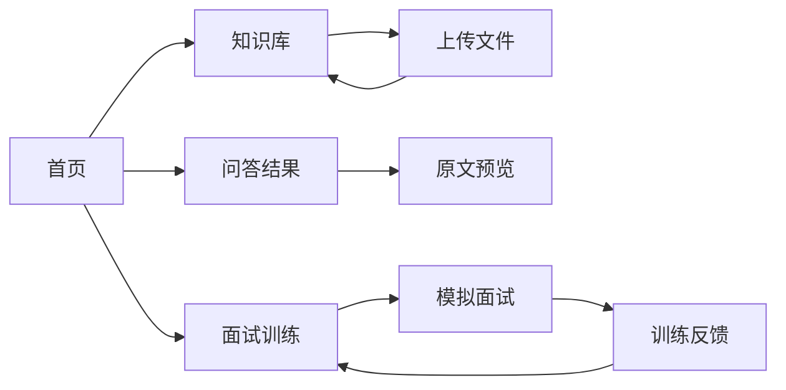

# Mind Vault 移动端原型说明

原型覆盖以下核心流程：

1. 首页发起资料问答
2. 上传文件并查看解析状态
3. 查看带引用的回答并跳转原文
4. 创建面试训练并进入模拟面试
5. 查看面试反馈与错题

交互原型文件：`mind-vault-mobile-prototype.html`

## 页面流转

## 微信小程序实现映射

| 原型页面 | 小程序页面建议 |
|---|---|
| 首页 | `pages/home/index` |
| 知识库 | `pages/library/index` |
| 文件详情 | `pages/document/detail` |
| 问答 | `pages/chat/index` |
| 原文预览 | `pages/document/preview` |
| 面试训练 | `pages/interview/index` |
| 模拟面试 | `pages/interview/session` |
| 训练反馈 | `pages/interview/feedback` |
