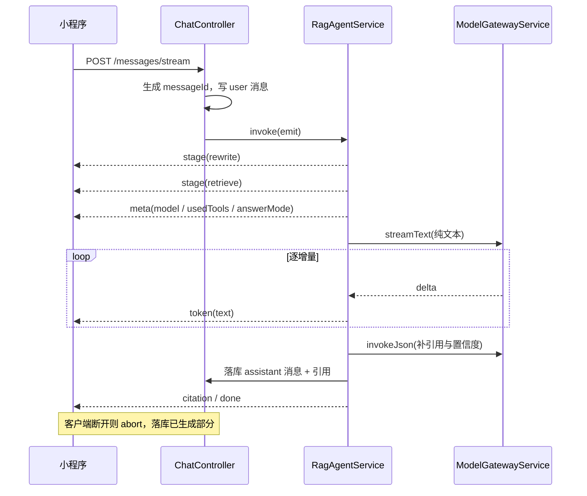

# 流式问答与 Markdown 渲染方案

> 覆盖范围：资料问答（ChatModule）的 SSE 流式输出改造与小程序端 Markdown 渲染
> 关联文档：technical-solution.md、业务代码梳理.md
> 方案版本：V0.2

## 1. 现状核实

### 1.1 当前是"假流式"

`ChatController.stream` 的执行顺序是：**先 `await chat.ask()` 拿到完整结果**，再用 `splitText(result.message.content, 48)` 把成品文本按 48 字切片，逐片写成 `token` 事件。

- 模型侧 `ModelGatewayService` 只暴露 `invokeJson`（内部为 `ChatOpenAI.invoke`），全仓库无 `.stream(` 调用。
- 因此 `response.flushHeaders()` 之后到生成结束之间，**响应体一个字节都不会发送**，客户端首字节时间等于完整生成时间。
- 事件顺序实际为：`(长时间静默) → meta → token×N → citation×N → done`，其中 `token` 只是把最终答案切碎后连发。

结论：接口形态是 SSE，但时序不是流式。用户感知的"打字机效果"只在网络层分批到达时才偶然出现。

### 1.2 前端无 Markdown 能力

`pages/chat/chat.wxml` 用 `<text class="message-content">{{item.content}}</text>` 直接渲染，`chat.wxss` 只给了 `white-space: pre-wrap`。仓库内所有 Markdown 相关代码都位于后端文档解析管线（`document/parser/**`），对话链路完全没有任何 md 处理。

模型输出中常见的标题、列表、粗体、代码块会以原始符号呈现。

### 1.3 已具备的能力（不需要重写）

- 小程序侧 `wx.request({ enableChunked: true })` + `onChunkReceived` + `utils/sse.ts` 的 `SseParser` 已实现按 `\n\n` 分包与跨包缓冲，接收端骨架可用。
- 后端 SSE 头部（`text/event-stream`、`no-cache`、`keep-alive`）与 `flushHeaders()` 已设置。
- 项目未启用 compression 中间件，不存在服务端 gzip 攒批的问题（上线仍需确认网关）。

### 1.4 由此派生的问题

| 问题 | 说明 |
| --- | --- |
| `meta` 事件过晚 | 元信息（model、usedTools、answerMode、记忆提示）要等全流程结束才发，前端无法提前展示"正在检索资料""已参考你的记忆" |
| 无心跳 | 生成期间静默，易被网关/客户端判定为空闲连接 |
| 无取消 | 客户端断开后编排与模型调用仍继续，白烧 token |
| 超时偏紧 | 小程序 `streamTimeout` = 60s，长回答会被中断 |
| 面试模块不涉及 | InterviewController 无 SSE 接口，本方案范围仅在对话链路 |

## 2. 必要性评估

"流式"其实是三件被混在一起的事，必要性与成本差异很大，需要分开决策：

| 层次 | 内容 | 现状 | 必要性 | 成本 |
| --- | --- | --- | --- | --- |
| **A. Markdown 渲染** | 把模型输出的 md 语义渲染出来 | 完全缺失，`**粗体**`、列表、代码块原样显示 | **必要**。这是缺陷，与是否流式无关 | 中（选型 + 组件 + 容错） |
| **B. 阶段可见性** | 生成期间给出"正在改写问题/检索资料/生成回答"，并提前下发 model、记忆提示 | `meta` 等全流程结束才发，静默期无任何反馈 | **必要**，性价比最高 | 低（不动输出协议、不动落库时机） |
| **C. 逐 token 真流式** | 模型生成过程中逐增量透传正文 | 现在是"生成完 → 切片连发" | **条件性，不是必须** | 高（改 answer 输出协议 + 中断语义 + 落库时机 + 心跳） |

### 2.1 为什么 C 是"条件性"

**支持做的理由**

- RAG 链路本身很长（改写 → 召回 → 分类 → 门控 → 检索 → 生成），复杂问题还会走 reasoning 模型，首字等待到 10s 以上完全可能。
- "总结这份文档的要点"这类问题是长回答，逐字滚动比干等舒服。
- 提前中断有实际价值：方向不对时立刻停止重问，省时间也省 token。

**弱化必要性的理由（本项目特有）**

- **当前实现已有打字机效果**。服务端把成品切片连发、前端逐片渲染，用户看到的差别只是"打字机开始得晚"，不是"没有打字机"。真流式的边际收益因此从"从无到有"降为"提前几秒"。
- **这个产品的读法是"读结论 → 点引用核对原文"**，答案普遍不长（几百字），用户不是逐字阅读型。而两段式会让正文先到、引用后到，反而打破"结论与依据同时到达"的原子性 —— 对可溯源型产品是实打实的反向代价。
- **单人维护的个人知识库**。真流式要持续付出的复杂度（answer 协议拆两段、中断落库语义、心跳、markdown 片段容错）会消耗维护预算，而这些预算投在检索质量与引用准确性上回报更直接。

### 2.2 判断依据应来自数据

前端已经把这份数据采下来了：`utils/telemetry.ts` 对每个 `/messages/stream` 请求记录 `durationMs`，记忆页的"参考情况"卡片可见取样（上限最近 50 次请求）。代入判据：

- **P50 ≤ 3s、P90 ≤ 5s** → 真流式基本是装饰，做 A + B 即可。
- **P50 ≥ 5s 或 P90 ≥ 10s，且长回答占比明显** → C 值得做。

同时看一眼回答长度分布（`chat_message.content` 的平均字数）：若绝大多数答案在 300 字以内，逐字流式的阅读价值很低。

### 2.3 结论

1. **A + B 直接做**。Markdown 渲染是明确缺陷；`stage` + 心跳 + 提前发 `meta` 几乎不需要动协议与落库逻辑，却能消掉"接口静默十几秒"这个最难受的点 —— 用户等待时看到"正在检索你的资料"，焦虑感下降比看到字在动更明显。
2. **C 等数据说话**，用 2.2 的分布决定，不预先支付复杂度。
3. 若数据支持做 C，按本文第 4 章的方案走（推荐两段式 B），Markdown 用 5.2 的 **S1**（结束后一次性渲染），避开流式片段容错的成本。

以下第 3–6 章按"要做真流式"完整给出方案，A + B 部分取用第 4.3、4.5、5.1、5.3 节即可。

## 3. 目标与验收口径

**目标**

1. 首字节时间从"完整生成时间"降到"检索完成 + 首字"。
2. 生成期间持续有数据到达，不被网关或小程序判定超时。
3. 引用与置信度的准确性不下降，且不因流式而错位。
4. 回答正文按 Markdown 正常渲染，流式过程中不闪烁、不崩溃。

**验收口径**

| 指标 | 现状 | 目标 |
| --- | --- | --- |
| TTFT（首 token 时间） | ≈ 全量生成时间（数秒至数十秒） | 检索完成 + 首字，目标 2–3s 内 |
| 生成期间的数据到达 | 无 | 持续，间隔 < 心跳周期 |
| 中断后刷新页面 | 无记录（未落库） | 能看到已生成的部分回答 |
| 引用/置信度 | 准确 | 不下降 |

> TTFT 与"持续到达"两项仅在采纳 C（真流式）后适用；仅做 A + B 时，验收标准是"静默期内有可读的阶段反馈"。

## 4. 后端改造方案

### 4.1 流的边界：只有 answer 阶段需要流

编排 `rewrite → recall → classify → gate → retrieve → answer` 中，前五个节点都是短 JSON 结构化输出，流式没有意义（用户也看不到中间产物）。真正需要逐字透传的只有最后的答案正文。

因此 `invokeJson` 保持不变，另加一个流式出口：

```ts
// ModelGatewayService
streamText(
  kind: ModelKind,
  messages: BaseMessage[],
  thinking: boolean,
  options: { signal?: AbortSignal },
): AsyncGenerator<string>
```

### 4.2 answer 阶段的输出协议（关键取舍）

当前 answer 要求模型输出 `{"answer":"","citedChunkIds":[],"confidence":0.0}`。**JSON 包装与逐字透传存在天然冲突**：用户要看的是 `answer` 字段的内容，但流式到达的是带转义、带结构的片段。三个选项：

| 方案 | 做法 | 优点 | 代价 |
| --- | --- | --- | --- |
| A 增量 JSON 解析 | 仍输出 JSON，服务端边收边用状态机提取 `answer` 字段值（处理 `\n`、`\"`、`\\` 等转义），同时从尾部结构得到引用 | 单次模型调用 | 需自研增量 JSON 解析器并覆盖转义用例；中文引号、行内代码中的反斜杠易踩坑 |
| **B 两段式（推荐）** | 正文用**纯文本流**（无 JSON 包装）逐 token 透传；流结束后另起一次 `fast` 调用，输入「问题 + 证据 + 正文」，产出 `{citedChunkIds, confidence}` | 正文零解析、可读性最好；引用与置信度独立可重试，失败不影响已呈现的正文 | 多一次短调用（数百 ms，此时正文已在屏幕上，不构成等待） |
| C 分隔符协议 | 要求模型先输出正文，再输出 `<<<META>>>{...}`，服务端按分隔符分流 | 单次调用 | 依赖模型严格遵守分隔符，DashScope 上不稳定，需兜底分支 |

**推荐 B**。理由：把"给人看的"和"给程序看的"彻底分开，避免解析器成为长期维护负担；引用补全失败时仍能给出可读回答，降级路径天然存在。

### 4.3 编排层事件化

`RagAgentService.invoke` 改为接收 `emit` 回调（或返回 AsyncGenerator），在关键位置产出事件：

- 各节点发出 `stage` 事件（`rewrite` / `retrieve` / `answer`），前端据此显示真实阶段而非假 loading。
- **检索与门控完成后立即发 `meta`**，携带 `model`、`usedTools`、`answerMode`、`messageId`。
- answer 阶段逐 token 发 `token`（由 `streamText` 驱动）。
- 引用补全后发 `citation`，最后发 `done`。

配套改动：`messageId` 从"落库时生成"提前到"进入编排前生成"，否则 `meta` 事件无法携带消息 id。

> 只做 B（阶段可见性）时，本条只需实现 `stage` + 提前 `meta`，无需引入 `streamText`。

### 4.4 落库与取消

- **中断也要落库**。`response.on('close')` → `AbortController.abort()` → 传入 `streamText` 停止模型调用；已生成内容照常写入 `chat_message`。
- 建议给消息加 `finishReason`（或复用 `interrupted` 语义字段），否则前端刷新后看到半截回答无从判断是模型就说到这里还是被中断。缺失该字段时，至少用 `confidence = null` 表达"未完成"。
- `ChatService.ask` 现在是一次性"算完 → 写 user + assistant + 引用"，流式后需拆为"先写 user 消息 → 流式生成 → 写 assistant 消息与引用"。
- 记忆抽取仍放在流结束之后 fire-and-forget，不要阻塞 `done` 事件。

### 4.5 HTTP 层可靠性

真流式被"攒成一次性返回"的常见原因是网关缓冲，而非服务端。需要：

- 响应头补 `Content-Type: text/event-stream; charset=utf-8`、`Cache-Control: no-cache, no-transform`、`X-Accel-Buffering: no`。
- **心跳**：生成期间每 10–15s 发 `: ping\n\n`（SSE 注释行）。现有 `SseParser.parseEvent` 因缺少 `event:`/`data:` 会自然丢弃，前端无需改动。
- 该路由必须排除 gzip 与代理缓冲（Nginx 侧 `proxy_buffering off`，并确认 `proxy_read_timeout` 足够）。
- 服务端设置单轮最大生成时长/`max_tokens` 上限，作为超长的兜底。

心跳与头部改造不依赖 C，做 B 时同样需要。

### 4.6 事件协议

| 事件 | 时机 | data 字段 | 前端处理 |
| --- | --- | --- | --- |
| `stage` | 每个编排节点开始 | `{ stage }` | 显示"正在改写问题/检索资料/生成回答" |
| `meta` | 检索与门控完成 | `{ messageId, usedTools, model, thinking, answerMode }` | 回填模型名、记忆提示、气泡元信息 |
| `token` | answer 阶段逐增量 | `{ text }` | 追加到当前气泡 |
| `citation` | 引用落库后 | 引用对象 | 渲染引用卡片 |
| `done` | 正常结束 | `{ confidence }` | 收尾、解除 loading |
| `error` | 异常 | `{ message }` | 降级提示，保留已生成内容 |
| `: ping` | 静默期心跳 | — | 忽略 |

保持 `event:` + `data:` 的既有写法，不引入新的传输格式。

### 4.7 时序



### 4.8 测试

- `ModelGatewayService`：chunk 转发正确、`abort` 后停止产出。
- `ChatController`：事件顺序 `stage* → meta → token* → citation* → done`；异常路径发 `error` 后仍 `end()`。
- `ChatService`：中断场景落库内容为已生成部分；记忆抽取仍在流结束后触发。

## 5. 小程序改造方案

### 5.1 接收端加固

现有 `SseParser` 骨架可用，需补：

- 兼容 `\r\n` 行尾、忽略 `:` 注释行（心跳）、忽略 `id:` / `retry:` 字段。
- 事件状态机：`stage` 更新阶段文案；`meta` 立即回填元信息；`token` 追加；`done` 收尾；`error` 降级并保留已生成文本。
- **setData 节流**：token 先累积到 buffer，50ms 或累计 N 字刷新一次，且只更新最后一条消息字段。逐 token 直接 setData 会明显卡顿。
- 取消与超时：`onUnload` 或用户点"停止"时调用 `requestTask.abort()`；`streamTimeout` 由 60s 提升到 300s，配合心跳保活。

### 5.2 流式渲染策略

Markdown 片段在流式过程中天然是残缺的（半截代码块、未闭合的列表），解析器必须容忍未闭合语法。两种策略：

- **S1（推荐先做）**：流式期间保持纯文本 + 尾部光标，`done` 后一次性对 `content` 做 Markdown 渲染。零容错风险，改动最小，已经能满足"看见字在动"的核心体感。**不做 C 时同样适用**：现在的实现是"一次性返回后逐片渲染"，S1 就是在这之上补一次结束后的 md 渲染。
- **S2（再做）**：增量渲染——只在段落边界（`\n\n`）闭合后解析已闭合段落，未闭合尾部继续按纯文本展示；已闭合部分**整段重解析**而非增量追加子节点，避免小程序侧无 DOM diff 导致的错位与闪烁。

### 5.3 Markdown 渲染选型

| 方案 | 优点 | 缺点 |
| --- | --- | --- |
| `rich-text` + 自转 nodes | 零依赖、实现成本最低 | 不支持代码块交互与复制、样式受限、长文本性能一般 |
| `towxml` | 成熟、内建 md 支持、代码高亮/表格/公式 | 体积较大，维护活跃度一般 |
| `mp-html` | 维护活跃、可按需裁剪、md 插件 + 代码高亮 + 表格 + latex | 需配合 marked 类解析器；仍要注意主包体积 |
| 自研受限语法组件 | 体积最小、流式容错最可控、样式完全自定义 | 需自行实现解析器与测试 |

建议：先用 `mp-html` 或 `towxml` 快速见效；若在意主包 2MB 限制与流式容错质量，则自研"标题 / 列表 / 粗体 / 行内码 / 代码块 / 引用 / 链接"这一小撮语法的组件。体积大的方案走分包。各库的体积与维护状态请在落地时以当前版本核对。

### 5.4 输出侧配合

渲染能力再强也救不回糟糕的输出。提示词需要：

- 明确要求 Markdown 输出规范（标题层级、列表、代码块标注语言）。
- 禁止小程序难以承载的语法（内联 HTML、脚注、复杂公式，除非已引入 latex 渲染）。

## 6. Vercel AI SDK 评估

**结论：不建议当前引入。**

1. **运行时不适配**。AI SDK 前端用法（`useChat`）依赖 `fetch` + `ReadableStream` + React，微信小程序运行时不提供这些，也无法接管 `wx.request` 的分块流。
2. **协议不兼容**。它的 data stream / UI message 协议是自有格式，与现有 SSE 事件协议不同，接入相当于前后端各写一层适配，并把后续演进绑到第三方协议上。
3. **与现有栈重复**。后端已有 `ModelGatewayService` + LangGraph 编排 + 结构化输出重试 + 引用过滤，AI SDK 的 `streamText` 不提供额外能力，反而要拆掉现有抽象层。

可借鉴的部分：`parsePartialJson`（若选择 4.2-A 的增量 JSON 路线）、输出节流（smoothStream）的思路。

**值得引入的时机**：将来做 Web 端（Next.js）对话页时，Web 侧用 `useChat` 确实省事。届时正确做法是后端保持自研 SSE，Web 端加一层薄适配（或额外暴露一个兼容端点），而不是让 AI SDK 反向决定后端协议与编排结构。

## 7. 实施顺序

| 阶段 | 内容 | 产出 |
| --- | --- | --- |
| P0 | Markdown 渲染（5.3 选型 + 5.2-S1）+ 阶段可见性（4.3 的 stage/提前 meta + 4.5 心跳）+ 5.1 接收端加固 | 消除静默期与原始 md 符号，成本最低、收益最直接 |
| P1 | 4.1 流式出口 + 4.2-B 两段式 + 4.4 落库与取消；前端 5.2-S2 增量渲染 | 真流式，TTFT 显著下降（是否启动由第 2 章判据决定） |
| P2 | 5.4 输出规范；指标（TTFT、首字延迟、中断率、引用补全耗时） | 可观测、可回归 |

## 8. 风险与取舍

| 风险 | 说明 | 应对 |
| --- | --- | --- |
| 两段式多一次调用 | 引用与置信度需二次调用 | 使用 fast 模型且输入已裁剪；此时正文已呈现，不构成感知延迟；失败时降级为无引用 |
| 中断语义 | 半截回答与完成回答难以区分 | 增加 `finishReason` 字段；缺失时用 `confidence = null` |
| setData 性能 | 逐 token 刷新导致卡顿 | buffer + 定时/定量节流，只更新目标消息字段 |
| 主包体积 | Markdown 渲染库可能较大 | 分包加载；或自研受限语法组件 |
| 网关缓冲 | 真流式仍被攒批 | `X-Accel-Buffering: no` + 关闭代理缓冲与压缩 |
| 解析器容错 | 流式片段语法不完整 | 采用 S1 先屏蔽风险；S2 阶段只对已闭合段落解析并整段重解析 |
| 过度投入 | 真流式复杂度持续消耗维护预算 | 按第 2 章判据决策；优先做 A + B |
